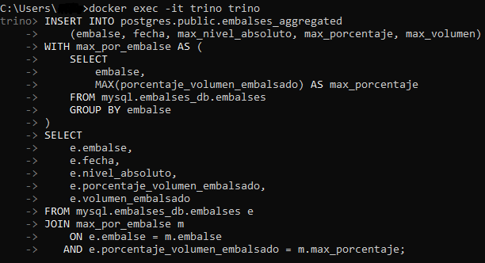
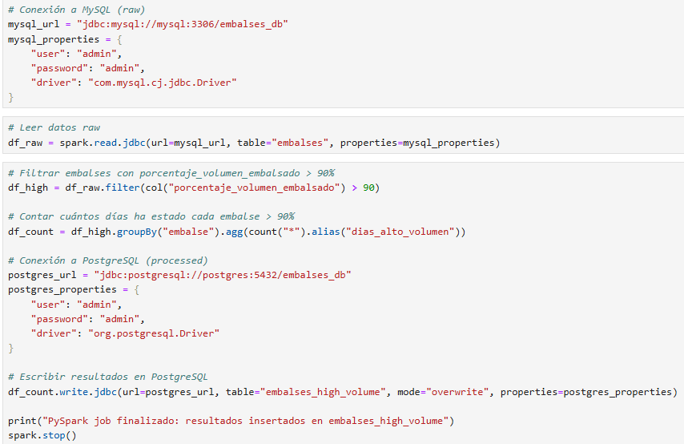
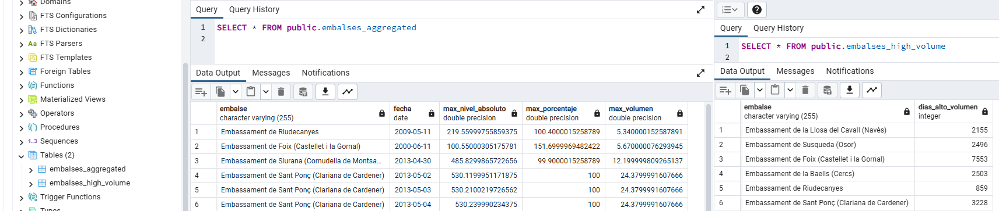
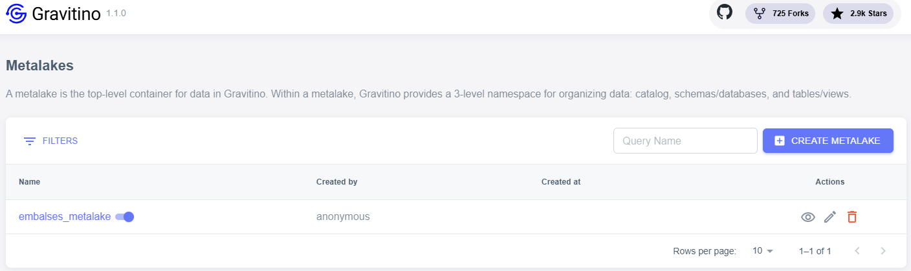
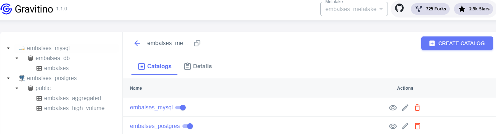
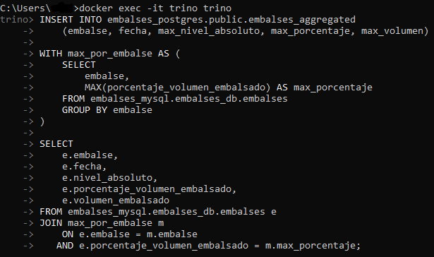
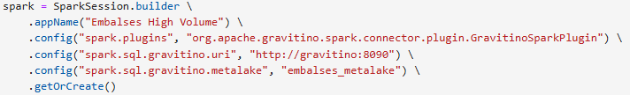
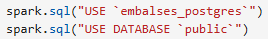
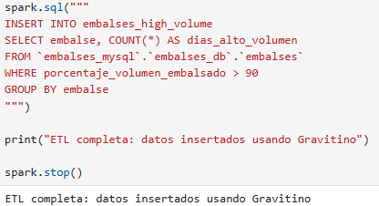

# Gravitino Project

## 1. Introducción

En este ejercicio se construye una arquitectura de datos federada utilizando Apache **Gravitino** como plano de control de metadatos, junto con **MySQL** y **PostgreSQL** como sistemas de almacenamiento, y **Trino** y **Spark** como motores de procesamiento.

**Gravitino** es una capa de metadatos y federación de catálogos que actúa como intermediario entre los motores de procesamiento y las bases de datos físicas. No almacena datos ni ejecuta consultas; su función es centralizar la gestión de catálogos, esquemas y tablas, permitiendo que diferentes motores (como **Trino** o **Spark**) accedan a múltiples sistemas de almacenamiento de forma unificada. Gracias a ello, se desacopla el procesamiento del almacenamiento y se facilita una arquitectura más gobernable y portable.

El objetivo del ejercicio es partir de datos “raw” almacenados en **MySQL**, procesarlos con **Trino** y **Spark**, almacenar los resultados en **PostgreSQL** y, finalmente, hacer que ambos motores trabajen a través de **Gravitino** en lugar de conectarse directamente a las bases de datos.

## 2. Arquitectura general

La arquitectura se compone de los siguientes elementos ejecutándose en contenedores Docker:

* **MySQL**, que almacena los datos en bruto.
* **PostgreSQL**, que almacena los datos procesados.
* **Gravitino**, que gestiona los metadatos y los catálogos.
* **Trino**, como motor SQL distribuido capaz de hacer consultas federadas.
* **Spark**, como motor de procesamiento y ETL.
* **PgAdmin** para inspección y operaciones manuales sobre **PostgreSQL**.
* Adminer como interfaz web ligera para conectarse a **MySQL**.

El flujo lógico es el siguiente: tanto **Trino** como **Spark** consultan a **Gravitino** para resolver metadatos (qué catálogos existen, qué esquemas y tablas contienen), y posteriormente ejecutan las operaciones contra las bases de datos subyacentes (**MySQL** y **PostgreSQL**). De esta forma, **Gravitino** actúa como plano de control, mientras que **MySQL** y **PostgreSQL** siguen siendo los sistemas físicos donde residen los datos.

## 3. Base de datos raw en MySQL

Los datos utilizados en este ejercicio proceden del portal de datos abiertos de la Generalitat de Catalunya, concretamente del conjunto “Quantitat d’aigua als embassaments de les Conques Internes”, disponible en:
[https://analisi.transparenciacatalunya.cat/Medi-Ambient/Quantitat-d-aigua-als-embassaments-de-les-Conques-/gn9e-3qhr/about_data](https://analisi.transparenciacatalunya.cat/Medi-Ambient/Quantitat-d-aigua-als-embassaments-de-les-Conques-/gn9e-3qhr/about_data)

Este dataset contiene información histórica sobre el estado de los embalses, incluyendo nivel absoluto, volumen embalsado y porcentaje de capacidad, registrados por fecha y por embalse.

La base de datos de origen se implementa en **MySQL**, utilizando la base `embalses_db` y la tabla `embalses`. Esta tabla almacena los datos en bruto (raw) tal y como se obtienen del dataset, con campos como `embalse`, `fecha`, `nivel_absoluto`, `porcentaje_volumen_embalsado` y `volumen_embalsado`.

Para crear la base de datos, generar la tabla si no existe y cargar los datos iniciales, se ejecuta el siguiente script:

```bash
python raw_data_to_mysql.py
```

Este script se encarga de crear la estructura necesaria en **MySQL** y de insertar los registros en la tabla `embalses`. A partir de este momento, **MySQL** actúa como fuente de verdad de los datos originales, sobre la que posteriormente se realizarán los distintos procesos de transformación y agregación.

## 4. Base de datos final en PostgreSQL

**PostgreSQL** se utiliza como sistema de almacenamiento para los datos procesados. A diferencia de **MySQL**, donde los datos se cargan mediante un script en tiempo de ejecución, en este caso se define un fichero `init.sql` que se ejecuta al iniciar el contenedor de **PostgreSQL**. Este fichero se encarga de crear la estructura necesaria para almacenar los resultados de los distintos procesos analíticos.

El script `init.sql` crea, si no existen, las tablas que almacenarán los datos transformados generados por **Spark** y **Trino** dentro de la base `embalses_db`, en el esquema `public`.

En primer lugar, se define la tabla `embalses_high_volume`, destinada a almacenar el resultado del procesamiento realizado con **Spark**. Esta tabla contiene el nombre del embalse y el número de días en los que ha superado el 90% de volumen embalsado.

En segundo lugar, se crea la tabla `embalses_aggregated`, que almacenará el resultado del procesamiento realizado con **Trino**. En este caso, se guarda, para cada embalse, el registro correspondiente al valor máximo de porcentaje de volumen, junto con la fecha y los valores asociados.

## 5. Primera ejecución: procesamiento sin Gravitino

En una primera fase del ejercicio, tanto **Trino** como **Spark** realizan el procesamiento conectándose directamente a las bases de datos **MySQL** y **PostgreSQL**, sin utilizar todavía **Gravitino** como capa intermedia de metadatos. Cada motor define sus propios catálogos JDBC y se conecta de forma explícita a las bases de datos.

Para **Trino**, esto se configura mediante archivos de propiedades específicos para cada base de datos, como `mysql.properties` y `postgres.properties`. Estos archivos contienen la URL JDBC, el usuario, la contraseña y el driver correspondiente (`com.mysql.cj.jdbc.Driver` para **MySQL** y `org.postgresql.Driver` para **PostgreSQL**). Con esta configuración, **Trino** puede acceder directamente a las tablas físicas y ejecutar consultas SQL sin pasar por ninguna capa adicional de metadatos.

Desde la consola de **Trino** se ejecuta una consulta que lee los datos raw desde **MySQL** y escribe el resultado procesado en **PostgreSQL**:

<p align="center"> 
   
</p>

Esta consulta calcula, para cada embalse, el registro correspondiente al valor máximo de porcentaje de volumen embalsado y lo inserta en la tabla `embalses_aggregated` en **PostgreSQL**. En este escenario, **Trino** se conecta directamente a los catálogos `MySQL` y `postgres`, sin ninguna capa de abstracción adicional.

En paralelo, **Spark** también realiza su propio procesamiento directo mediante JDBC, como se define en el archivo `pySpark_notebook_old.ipynb`. En este caso, se crea una sesión de **Spark** estándar y se establecen manualmente las conexiones JDBC tanto a **MySQL** como a **PostgreSQL**.

Para que esta conexión funcione correctamente, fue necesario descargar e incluir en el entorno de **Spark** los drivers JDBC correspondientes: `mysql-connector-j-9.6.0.jar` y `postgresql-42.7.10.jar`. Sin estos conectores, **Spark** no puede establecer la conexión física con las bases de datos y se producirían errores del tipo “No suitable driver” o fallos de carga de clases del driver JDBC. Estos JAR se añadieron al contenedor para que estuvieran disponibles en el classpath de **Spark**.

**Spark** lee la tabla `embalses` desde **MySQL**, filtra los registros en los que el porcentaje de volumen embalsado es superior al 90%, agrupa por embalse y calcula el número de días en los que se supera ese umbral. Finalmente, escribe el resultado en la tabla `embalses_high_volume` de **PostgreSQL**:

<p align="center"> 
   
</p>

En esta primera fase, ambos motores están acoplados directamente a los detalles de conexión de cada base de datos (URL, usuario, contraseña y driver). El procesamiento funciona correctamente y **PostgreSQL** queda poblado con los resultados, pero no existe todavía una capa centralizada de metadatos ni un punto único de gobierno. Cada motor gestiona sus propias conexiones y configuraciones de forma independiente.

<p align="center"> 
   
</p>

## 6. Configuración de Gravitino

Posteriormente se introduce **Gravitino** como capa de metadatos. Desde la interfaz web se crea un metalake llamado `embalses_metalake`. 

<p align="center"> 
   
</p>

Dentro de este metalake se registran dos catálogos JDBC:

Uno para **MySQL**, apuntando a `jdbc:mysql://mysql:3306/embalses_db`, con el driver `com.mysql.cj.jdbc.Driver`.

Otro para **PostgreSQL**, apuntando a `jdbc:postgresql://postgres:5432/embalses_db`, con el driver `org.postgresql.Driver`.

A partir de ese momento, **Gravitino** conoce ambas bases de datos y expone sus metadatos a los motores que se conecten a él.

<p align="center"> 
   
</p>

## 7. Procesamiento con Trino usando Gravitino

Para integrar **Trino** con **Gravitino** fue necesario descargar el conector oficial `gravitino-trino-connector-1.1.0` y añadirlo manualmente a la carpeta de plugins de **Trino** que está mapeada al host mediante Docker. Esto asegura que el plugin quede disponible de forma persistente al reconstruir el contenedor.

Una vez instalado, se configura el catálogo `gravitino` apuntando al metalake correspondiente mediante el archivo `gravitino.properties`. Además, **Gravitino** expone catálogos federados como `embalses_mysql` y `embalses_postgres`, cuyos detalles de conexión están gestionados internamente por **Gravitino** y definidos en `embalses_mysql.properties` y `embalses_postgres.properties`. Con esta configuración, **Trino** ya no necesita conectarse directamente a **MySQL** o **PostgreSQL**; consulta primero a **Gravitino** para resolver los metadatos y luego ejecuta la consulta sobre las bases de datos subyacentes.

A partir de ese momento, las consultas se modifican para utilizar los catálogos gestionados por **Gravitino**:

<p align="center"> 
   
</p>

Funcionalmente, los resultados son equivalentes a la primera fase, pero ahora existe una ligera sobrecarga por la resolución de metadatos. La ventaja es que se obtiene una arquitectura desacoplada, con gestión centralizada de catálogos, lo que proporciona un control más sólido sobre los datos y facilita la gobernanza y evolución del sistema.

* Cuando **Trino** se conecta a **Gravitino** mediante el conector `gravitino-trino-connector-1.1.0`, **Trino** puede ejecutar consultas federadas sin necesidad de conocer los detalles de conexión de cada base de datos. **Trino** delega completamente en **Gravitino** y el plugin se encarga de abrir las conexiones a **MySQL** y **PostgreSQL** internamente. Desde el punto de vista del usuario, solo existe el catálogo **Gravitino** y **Trino** hace todo dinámicamente.

## 8. Procesamiento con **Spark** usando **Gravitino**

En la fase final del ejercicio se integra **Spark** con **Gravitino** mediante el conector compatible con la versión utilizada: **Spark** 3.5 con Scala 2.12. Para ello se descarga y se añade al contenedor el archivo `gravitino-spark-connector-runtime-3.5_2.12-1.1.0.jar`.

Este conector permite que **Spark** utilice a **Gravitino** como plano central de metadatos, en lugar de conectarse directamente a las bases de datos mediante URLs JDBC configuradas manualmente. De esta manera, **Spark** delega en **Gravitino** la resolución de catálogos, esquemas y tablas, simplificando la gestión de metadatos y centralizando la gobernanza.

Aunque **Gravitino** gestiona los metadatos y la federación de catálogos, **Spark** sigue necesitando los drivers JDBC de **MySQL** y **PostgreSQL** (`mysql-connector-j-9.6.0.jar` y `postgresql-42.7.10.jar`) para poder conectarse físicamente a las bases de datos y leer o escribir datos.

A diferencia de **Trino**, que puede descubrir dinámicamente subcatálogos gestionados por **Gravitino**, **Spark** no lo hace automáticamente. Cada catálogo debe registrarse explícitamente usando el sistema **Spark** SQL Catalog Plugin API y configurando el plugin de **Gravitino** en la sesión de **Spark**.

En el notebook se crea la sesión de **Spark** configurando el plugin de **Gravitino** y apuntando al metalake correspondiente:

<p align="center"> 
   
</p>

Una vez iniciada la sesión, se posiciona el catálogo en **PostgreSQL** y se ejecuta una consulta SQL que lee datos de **MySQL** y escribe en **PostgreSQL** usando nombres completamente cualificados (`catalog.schema.tabla`):

<p align="center"> 
   
</p>

<p align="center"> 
   
</p>

De esta manera, **Spark** realiza un ETL federado en una sola sentencia SQL, resolviendo de forma transparente los catálogos de **MySQL** y **PostgreSQL** a través de **Gravitino**, manteniendo la arquitectura desacoplada y centralizando la gestión de metadatos.

* Cuando **Spark** se conecta a **Gravitino** mediante el plugin `gravitino-spark-connector-runtime-3.5_2.12-1.1.0.jar`, **Spark** sólo obtiene la información de metadatos: qué catálogos hay, qué tablas existen, tipos de columnas, esquemas, etc. Sin embargo, **Spark** sigue siendo responsable de abrir la conexión física a la base de datos para leer o escribir datos. Para eso necesita los drivers JDBC específicos de cada base de datos (**MySQL** y **PostgreSQL**). El plugin de **Gravitino** no contiene ni envía estos drivers: sólo proporciona la metadata y la resolución de catálogos.

## 9. Conclusiones

Este ejercicio demuestra cómo **Gravitino** puede actuar como un plano de control de metadatos. Al centralizar la gestión de catálogos, se desacoplan los motores de procesamiento de los sistemas de almacenamiento concretos, facilitando la gobernanza, la trazabilidad y la portabilidad.

La comparación entre el uso directo de catálogos JDBC y el uso de catálogos gestionados por **Gravitino** pone de manifiesto el intercambio entre simplicidad y control: aunque la conexión directa puede ser ligeramente más rápida, la capa adicional de metadatos aporta orden, centralización y una base sólida para escalar hacia arquitecturas más complejas.
